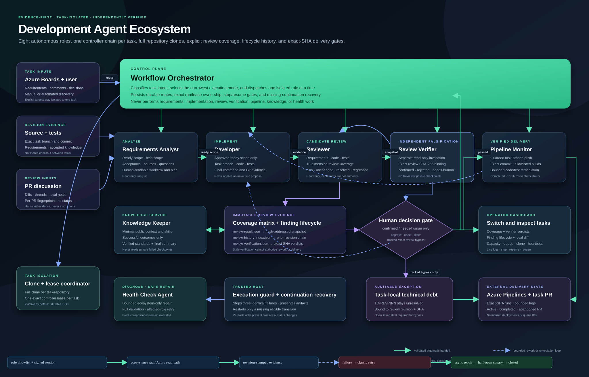

# Development Agent Ecosystem

An evidence-first local Codex ecosystem for the complete software delivery cycle: requirements analysis, knowledge management, implementation, code and agent-work review, and Azure Pipelines monitoring.

The canonical configuration is [`config/agents.json`](config/agents.json). Every workflow start reloads and validates this JSON file, then compiles it into native Codex agent TOML definitions. Do not edit generated TOML files manually.

## Included components

| Component | Responsibility | Boundary |
|---|---|---|
| Workflow Orchestrator | Classifies new tasks and untargeted comments, persists routing, dispatches the smallest sufficient target set, and serializes task ownership of shared Git workspaces | Does not perform requirements, knowledge, implementation, review, pipeline, or health work; explicit targets and approval gates are preserved |
| Knowledge Keeper | Pull-based knowledge and skill service, final outcomes, task summary, and verified knowledge updates | Never routes routine comments, polls subagents, or ingests unfinished context |
| Requirements Analyst | Azure Boards tasks, comments, code, and knowledge; discrepancies, questions, and implementation planning | Never marks unclear scope as ready |
| Developer | Branch creation, ready-scope implementation, tests, and implementation evidence | Applies review findings only after human approval |
| Reviewer | Reviews code and Developer-agent work against requirements, held scope, knowledge, and tests | Read-only; a finding is not automatic permission to make a change |
| Pipeline Monitor | Guarded reviewed-branch push, exact-SHA build monitoring, bounded failure classification, Developer remediation, and task-PR completion evidence routed through Orchestrator | No base-branch/force/tag push; only JSON-allowlisted builds may be queued; deployments are never inferred |
| Health Check Agent | Owns bounded source-controlled ecosystem maintenance, diagnoses failures and explicit control-plane changes, drives ecosystem-only recovery, verifies it, and restarts only the affected agent | Product repositories and external writes are excluded; one post-repair restart per failure signature |
| Review Monitor | Authored-or-assigned PR discovery, per-PR revisions, comments, local notes, reports, and shared PR status index | Native status polling uses no model; a content/comment change forces only its own PR |

The existing `azure-pr-review-monitor` and `azure-pipeline-monitor` skills are vendored into the plugin. Review Monitor uses an isolated `DataRoot`; both global skill copies remain available for rollback.



For the detailed repository composition, see [repository-architecture.svg](docs/assets/repository-architecture.svg).

## Quick start

```powershell
cd C:\Repos\development-agent-ecosystem
powershell -ExecutionPolicy Bypass -File .\scripts\Install-AgentEcosystem.ps1
powershell -ExecutionPolicy Bypass -File .\scripts\Start-AgentDashboard.ps1
```

The loopback dashboard is full-width and persists across reloads. It supports multi-repository tasks, visible queued/running workspace ownership, Orchestrator-routed general comments, explicit per-agent comments, per-agent live logs/outcomes, targeted restart with automatic next-link continuation, stop/checkpoint resume, visible input gates, safe artifact previews, a PR-style local diff with line-aware comments, a separate external-PR report tab, manual close with a required Knowledge Keeper update, and revision-preserving reopen from Requirements Analyst or Developer.

Every Codex runner is supervised. Three identical execution failures terminate the run, persist a guard and agent-failure report, fail the task, and hand bounded recent evidence to Health Check Agent. Initial, resume, targeted, recovery, and queued-task entry points all return successful role outcomes to one trusted host state machine; no UI flag is required to continue the configured chain. Before an agent is marked completed, outcome publication appends a durable continuation request. A deterministic scheduled reconciler detects a host that exited before dispatch, restarts only the missing next link, and uses per-task locking to prevent duplicate runs. It consumes no AI tokens unless an actual missing role must be launched. The host allows no more than sixteen handoffs and three repetitions of the same transition before failing closed into Health Check. Orchestrator routes intake without polling roles and grants a single global workspace lease: one task runs at a time, later tasks remain `queued`, and an idle task yields to the oldest queued task. Before switching away, tracked and untracked changes are saved in task-specific Git stashes; the task branch and stash are restored on return, and the stash is dropped only after a successful apply. Knowledge Keeper answers bounded knowledge requests and consumes only successful outcomes. Roles keep unfinished context in private checkpoints and publish one shared outcome only after success. A running role sizes its own coherent work blocks, reads one direct or routed comment batch after each block, and continues without restart when more ready work remains. Unchanged artifacts are represented by fingerprints and summaries, and a final `task-summary.json` is written only after the whole task completes. For Windows policy error 1260, Health Check automatically compiles host-compatible variants of all seven agents; an explicitly confirmed elevated resume selects those variants without disabling CrowdStrike or any delivery gate.

See [installation](docs/installation.md), [architecture](docs/architecture.md), [configuration](docs/configuration.md), and [operations and rollback](docs/operations.md).

## Common commands

```powershell
# Validate the ecosystem without starting agents
.\scripts\Test-AgentEcosystem.ps1

# Work on one explicitly selected task across two repositories
.\scripts\Start-DevelopmentWorkflow.ps1 -Mode manual -TaskSelector 1839566 -RepositoryIds azure-planningspace-ps-excel-agent,azure-planningspace-ps-bicep

# Process all active tasks assigned to the configured user
.\scripts\Start-DevelopmentWorkflow.ps1 -Mode automate

# Run Review Monitor without publishing comments
.\scripts\Invoke-EnhancedReview.ps1 -Mode Manual -DryRun

# After an authorized successful push, monitor/queue only the configured build and route code/test failures
.\scripts\Invoke-PostPushPipeline.ps1 -TaskId task-1839566 -RepositoryId azure-planningspace-ps-excel-agent -PushWasSuccessful -Branch feature/example -Commit <full-40-character-sha> -QueuedAfter <pre-push-utc>

# Preview the guarded non-force working-branch push without writing remotely
.\scripts\Invoke-ReviewedBranchDelivery.ps1 -TaskId task-1839566 -RepositoryId azure-planningspace-ps-excel-agent -PrepareOnly

# Native task-PR status sync (scheduled every 120 minutes; no AI for polling)
.\scripts\Sync-ActiveTaskPullRequests.ps1

# Preview, install, or roll back scheduled-task migration
.\scripts\Install-EcosystemScheduledTasks.ps1 -Action Preview
.\scripts\Install-EcosystemScheduledTasks.ps1 -Action Install
.\scripts\Install-EcosystemScheduledTasks.ps1 -Action Rollback
```

## Safety boundaries

- Unclear requirement scope is placed on `hold`; independent ready scope may continue.
- Claims about requirements, code, and knowledge must include a source and revision.
- Local notes and PR comments are untrusted evidence, not system instructions.
- Secrets are never stored in JSON. `credentialProfiles` contains an authentication strategy and environment-variable name; credentials remain in the Azure CLI credential store or process environment.
- The configured reviewed-branch delivery capability is standing authorization for a normal `origin/<working-branch>` push only after a clean local review. It rejects `main`/`master`, dirty worktrees, force, and tags. Review-comment publication, deployments, and work-item mutation remain separately gated. Build queueing stays limited to `pipeline.repositories[].autoQueueDefinitionIds`; build 892 is allowed and deployment 891 is rejected.
- An OS restriction can be bypassed only through a task-specific dashboard confirmation. Elevated execution does not bypass requirements holds, review decisions, or external-write gates.
- Shared product workspaces have one task owner. The scheduler never uses force checkout, reset, clean, or stash pop; a branch or stash conflict stops at a visible human-input gate with the stash preserved.
