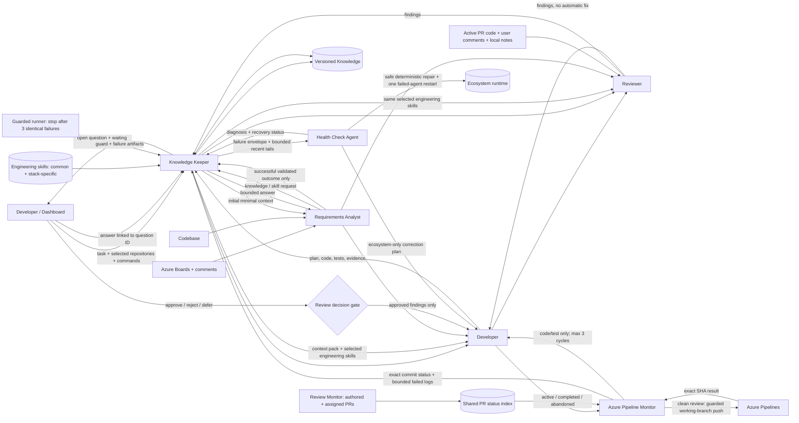

# Architecture and responsibilities

The editable vector overview is available below and as a standalone file: [ecosystem-architecture.svg](assets/ecosystem-architecture.svg).


## Repository composition

The repository-level diagram shows how source-controlled configuration, prompts, skills, scripts, generated agents, runtime state, and external services interact: [repository-architecture.svg](assets/repository-architecture.svg).


| Repository area | Role in the system |
|---|---|
| `config/agents.json` | Canonical agents, repositories, workspaces, credential strategy, modes, health policy, knowledge paths, and approval gates |
| `prompts/common` | Evidence, task-protocol, and approval rules shared across roles |
| `prompts/roles` | Role-specific behavior for Keeper, Analyst, Developer, Reviewer, Pipeline Monitor, and Health Check Agent |
| `plugins/development-agent-ecosystem/skills` | Workflow and health-diagnostics skills plus vendored Azure PR and pipeline monitors |
| `scripts/AgentEcosystem.psm1` | JSON loading, semantic validation, path expansion, and TOML generation primitives |
| `scripts/Start-DevelopmentWorkflow.ps1` | Fresh-config startup, multi-repository workspace routing, task creation/resume, knowledge import, and Keeper launch |
| `scripts/Continue-AgentChain.ps1` | Event-driven next-link selection after successful targeted execution; stops at human, review, delivery, and failure gates |
| `scripts/Invoke-ReviewedBranchDelivery.ps1` | Clean-review, clean-worktree, non-base, non-force branch push followed by exact-SHA monitoring |
| `scripts/Invoke-PostPushPipeline.ps1` | Exact pushed-ref verification, allowlisted build queueing, native run monitoring, result publication, and bounded Developer remediation routing |
| `scripts/Sync-TaskPullRequestStatus.ps1` | One-shot task-branch PR correlation; completed PR triggers final Keeper work, abandoned PR opens a question |
| `scripts/Sync-ActiveTaskPullRequests.ps1` | Shared model-free PR lifecycle index on a configurable schedule (120 minutes by default) |
| `scripts/Invoke-GuardedCodex.ps1` | Native Codex supervision, UTF-8 log normalization, three-identical-failure cutoff, and execution-guard artifacts |
| `scripts/Invoke-EcosystemHealthCheck.ps1` | Deterministic diagnostics, safe derived-state repairs, and OS-policy compatibility profile generation |
| `scripts/Start-AgentHealthRecovery.ps1` | One-attempt, ecosystem-only automatic source recovery using a bounded recent-log diagnostic bundle |
| `scripts/Save-AgentCheckpoint.ps1` | Private per-role context for running, waiting, or failed attempts; not shared with Knowledge Keeper |
| `scripts/Publish-AgentOutcome.ps1` | Validates configured artifacts, completes the role, and only then publishes its shared outcome |
| `scripts/Invoke-EnhancedReview.ps1` | Per-PR comment fingerprints, pending AI-processing state, and targeted Review Monitor invocation |
| `dashboard` | Full-width loopback UI with local diff review, external PR reports, persisted statuses, live logs, interventions, manual closure, revision reopen, and tracked elevated runspaces |
| `knowledge/managed` | Versioned managed knowledge with seed-import provenance |
| `%LOCALAPPDATA%/Codex/development-agent-ecosystem` | Mutable task ledgers, review prompts, notes, reports, and scheduler backups |

### Extension points shown on the diagram

Dashed green `+` badges identify supported extension points:

| Badge | How to extend it |
|---|---|
| `+ REPOSITORIES` | Add an enabled object to `repositories[]`; the dashboard and Review Monitor pick it up on their next start |
| `+ PROMPT PATHS` | Add a Markdown file and reference it from the target agent's `promptPaths[]` |
| `+ SKILL.MD` | Add a plugin skill directory containing `SKILL.md` and `agents/openai.yaml`, then reference it from `skillPaths[]` |
| `+ KNOWLEDGE ROOT` | Add a seed source, managed component knowledge, or a verified decision root under `knowledge` |
| `+ UI / DOCS` | Add maintained operator guidance or dashboard assets without changing agent contracts |
| `+ VALIDATORS` | Extend semantic checks in `AgentEcosystem.psm1` and the corresponding JSON schema together |
| `+ COMPILE STEPS` | Extend agent TOML generation while keeping `config/agents.json` canonical |
| `+ WORKFLOWS` | Add a guarded runtime script and invoke it through Knowledge Keeper or the dashboard |
| `+ REVIEW INPUTS` | Add a trusted adapter that normalizes evidence before it enters the untrusted review context |
| `+ UI ROUTES` | Add a loopback API route with session-token validation and a matching dashboard control |
| `+ AGENT ROLE` | Add an agent object, role prompt, skills, handoffs, required artifacts, and schema coverage |
| `+ ARTIFACT SCHEMA` | Add a versioned JSON schema and include the artifact in the producer and consumer contracts |
| `+ AUTH` | Add a credential profile that references a CLI or environment-variable name, never a plaintext secret |

## Component interaction

Agent progression is event-driven: a successful targeted restart calls the next eligible role directly and never polls role state in a loop. Failed execution is handed to Health Check; a verified repair gets one failed-agent-only retry and then rejoins the chain. Review Monitor owns authored/assigned PR discovery and the shared status index, while Pipeline Monitor owns exact task-branch correlation, build/remediation, and the completion gate.

Knowledge flow is pull-based. Knowledge Keeper issues a minimal initial context and answers explicit knowledge or skill requests; it never loops over `wait` or polls role logs. Each role autonomously sizes coherent work blocks. At the end of each block it reads applicable comments once, applies one ordered batch, and decides whether another block is needed in the same invocation. Working details remain in the role's private checkpoint until that role succeeds. Only a validated terminal outcome enters shared context. Knowledge Keeper then decides whether the outcome changes task decisions, coding rules, or managed knowledge. After all applicable roles complete, it writes `task-summary.json` for the whole task.



## Task lifecycle

```mermaid
sequenceDiagram
    participant U as Developer
    participant K as Knowledge Keeper
    participant A as Requirements Analyst
    participant D as Developer Agent
    participant R as Reviewer Agent
    participant P as Pipeline Monitor
    participant H as Health Check Agent
    participant G as Execution Guard

    U->>K: task ID / URL / selected repositories / instruction
    K->>A: verified context request
    A-->>K: ready scope, held scope, questions, sources
    alt independent ready scope exists
        K->>D: approved implementation context
        D-->>K: plan, changes, tests, implementation evidence
        K->>R: requirements + held scope + implementation
        R-->>K: findings and verdict
        R-->>D: findings for visibility
        U->>K: approve / reject / defer finding
        K->>D: approved findings only
        D->>P: pushed branch and exact commit
        P-->>K: exact-SHA result + bounded classified logs
        alt code or test failure and cycle remains
            P-->>K: pipeline-remediation-request
            K->>D: only the failed code/test scope
            D->>R: locally verified remediation
            R-->>K: remediation review
            U->>D: authorize next push
            D->>P: new pushed SHA + remediation cycle
        else infrastructure / unknown / no run / limit reached
            P-->>K: terminal evidence for Health or operator gate
        end
        K->>K: publish verified knowledge and task history
    else an agent or workflow fails
        G->>G: count normalized identical failures
        G-->>K: third failure: terminate and persist guard artifact
        K->>K: persist agent-failure artifact and failed status
        K->>H: failure signature + bounded recent tails + summaries
        H-->>K: diagnosis and deterministic repair result
        K->>H: one bounded ecosystem-only recovery attempt
        H-->>K: repaired / waiting / failed + validation
        K-->>U: live recovery status and Resume action
    else all scope is blocked by unanswered questions
        K-->>U: question-opened + waiting status + explicit hold
        U->>K: targeted answer or corrective command
        K->>K: question-resolved; reread linked answer
    end
```

## Per-task artifacts

Runtime task history is stored outside the repository under `%LOCALAPPDATA%/Codex/development-agent-ecosystem/tasks/<task-id>`:

- `task.json`: task identity, ordered `repositoryIds[]`, backward-compatible primary `repositoryId`, and current state;
- `task-ledger.jsonl`: append-only communication, workflow and agent status, `question-opened` / `question-resolved`, and user intervention comments;
- `agent-activity.jsonl`: append-only factual per-agent progress used by the configurable live dashboard view;
- `resume-plan.json`: the checkpoint snapshot listing only agents permitted to run and completed agents that must be preserved;
- `resume-artifact-index.json`: SHA-256 fingerprints used to identify changed artifacts without model rereads;
- `agent-checkpoints/<agent-id>.json`: private unfinished-role context, never consumed by Knowledge Keeper or the dashboard outcome viewer;
- `context-pack.json`: context selected by Knowledge Keeper;
- `requirements-analysis.json`: ready scope, held scope, gaps, and questions;
- `implementation-plan.json` and `implementation-result.json`;
- `review-result.json` and `review-decisions.json`;
- `delivery-result.json`, `pipeline-result.json`, `pull-request-status.json`, optional `pipeline-remediation-<signature>.json`, `knowledge-update.json`, and final `task-summary.json`;
- `task-closure.json` plus `revisions/revision-<n>/` snapshots for manual closure and bug/rework reopen.
- `agent-failure-*.json`, `health-check-result.json`, `health-recovery-result.json`, and health recovery logs.
- `health-repair-routing.json` records a bounded, single-owner correction handoff when Health Check cannot perform the repair inside the ecosystem recovery workspace.

`task.json` is a current-state projection used for fast dashboard rendering. `task-ledger.jsonl` remains the durable public history. Open questions are reconstructed by subtracting every `question-resolved` evidence reference from `question-opened` events; a targeted dashboard answer closes only its selected question. Applicable comments are coalesced at end-of-block checkpoints, so saving comments does not restart a running role. Agents do not poll while a block is running and perform a final comment check before outcome publication. General resume computes a checkpoint and dispatches only unfinished roles; explicit targeted restart dispatches exactly one stopped or completed role. Fingerprints in `resume-artifact-index.json` let roles reuse summaries for unchanged artifacts. The dashboard polling itself is deterministic and does not invoke a model. Health recovery receives configured tails rather than complete historical logs. PR comment fingerprints are stored per PR; only that PR is forced, while `pending-review-changes.json` records `pending-ai-review` or `requires-human-intervention` until AI processing succeeds. Pipeline Monitor uses low reasoning effort and lets its native monitor perform repeated status polling without repeated model turns. Post-push classification is also deterministic: only code/test failures create a deduplicated Developer request, while infrastructure/no-run/unknown states remain at their proper gate and the cycle stops after three attempts.

Every context pack has an `engineeringGuidance` section. Knowledge Keeper derives the stack from repository evidence, always selects pragmatic DRY, KISS, SOLID, YAGNI, separation-of-concerns, testability, and maintainability guidance, and adds only the applicable .NET, JavaScript/TypeScript, and React skills. Developer implements against that selection; Reviewer uses the same selection and reports a principle violation only when it has a concrete correctness, maintenance, or testing consequence.

Schemas are stored under `config/schemas`. Knowledge Keeper may publish only evidence-backed claims with all required evidence fields.
