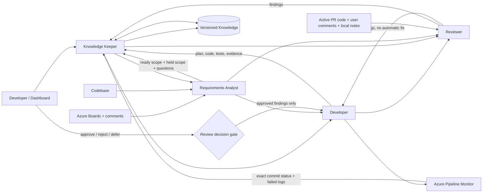

# Architecture and responsibilities

The editable vector overview is available below and as a standalone file: [ecosystem-architecture.svg](assets/ecosystem-architecture.svg).

## Component interaction

## Task lifecycle

## Per-task artifacts

Runtime task history is stored outside the repository under `%LOCALAPPDATA%/Codex/development-agent-ecosystem/tasks/<task-id>`:

- `task.json`: task identity and current state;
- `task-ledger.jsonl`: append-only communication and events from every agent;
- `context-pack.json`: context selected by Knowledge Keeper;
- `requirements-analysis.json`: ready scope, held scope, gaps, and questions;
- `implementation-plan.json` and `implementation-result.json`;
- `review-result.json` and `review-decisions.json`;
- `pipeline-result.json` and `knowledge-update.json`.

Schemas are stored under `config/schemas`. Knowledge Keeper may publish only evidence-backed claims with all required evidence fields.
