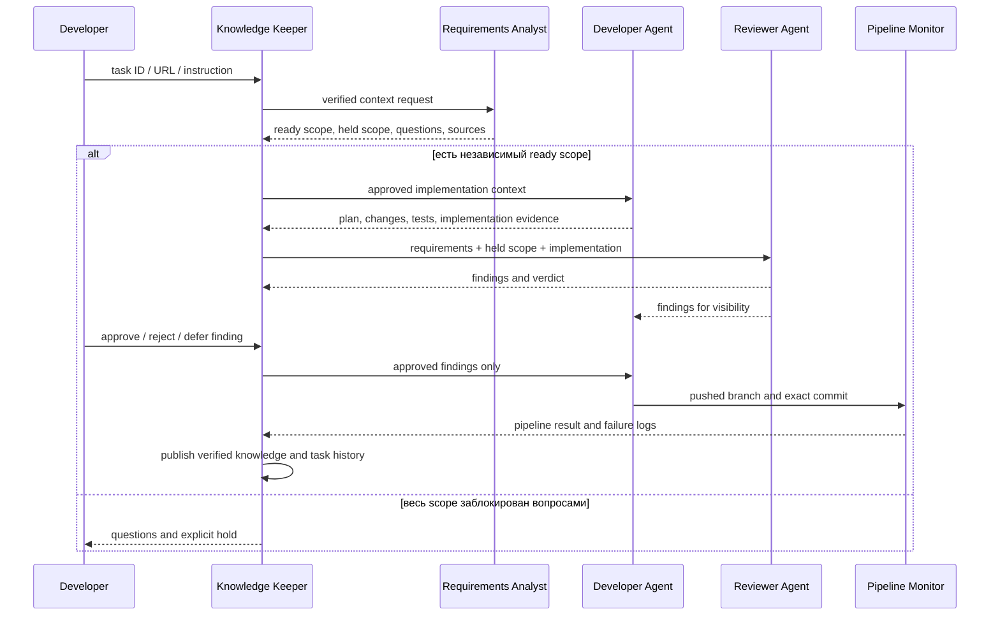

# Архитектура и ответственности

## Взаимодействие

## Жизненный цикл задачи

## Артефакты на задачу

Runtime хранит историю вне repository в `%LOCALAPPDATA%/Codex/development-agent-ecosystem/tasks/<task-id>`:

- `task.json` — identity и текущее состояние;
- `task-ledger.jsonl` — append-only диалог и события всех agents;
- `context-pack.json` — выданный Knowledge Keeper контекст;
- `requirements-analysis.json` — ready/held scope, gaps и вопросы;
- `implementation-plan.json`, `implementation-result.json`;
- `review-result.json`, `review-decisions.json`;
- `pipeline-result.json`, `knowledge-update.json`.

Schemas находятся в `config/schemas`. Knowledge Keeper публикует в versioned KB только утверждения с обязательными evidence fields.
