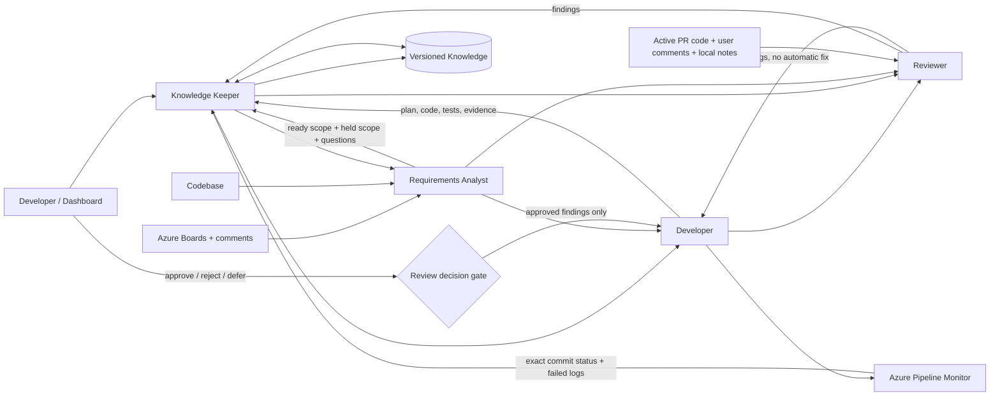

# Architecture and responsibilities

The editable vector overview is available below and as a standalone file: [ecosystem-architecture.svg](assets/ecosystem-architecture.svg).

## Repository composition

The repository-level diagram shows how source-controlled configuration, prompts, skills, scripts, generated agents, runtime state, and external services interact: [repository-architecture.svg](assets/repository-architecture.svg).

| Repository area | Role in the system |
|---|---|
| `config/agents.json` | Canonical agents, repositories, workspaces, credential strategy, modes, knowledge paths, and approval gates |
| `prompts/common` | Evidence, task-protocol, and approval rules shared across roles |
| `prompts/roles` | Role-specific behavior for Keeper, Analyst, Developer, Reviewer, and Pipeline Monitor |
| `plugins/development-agent-ecosystem/skills` | Workflow skills plus vendored Azure PR and pipeline monitors |
| `scripts/AgentEcosystem.psm1` | JSON loading, semantic validation, path expansion, and TOML generation primitives |
| `scripts/Start-DevelopmentWorkflow.ps1` | Fresh-config startup, task creation/resume, knowledge import, and Keeper launch |
| `scripts/Invoke-EnhancedReview.ps1` | Active PR comments, local notes, discussion hashing, and vendored Review Monitor invocation |
| `dashboard` | Loopback operator UI for manual/automate selection, persistent task and per-agent status, workflow comments, notes, and review launch |
| `knowledge/managed` | Versioned managed knowledge with seed-import provenance |
| `%LOCALAPPDATA%/Codex/development-agent-ecosystem` | Mutable task ledgers, review prompts, notes, reports, and scheduler backups |

### Extension points shown on the diagram

Dashed green `+` badges identify supported extension points:

| Badge | How to extend it |
|---|---|
| `+ REPOSITORIES` | Add an enabled object to `repositories[]`; the dashboard and Review Monitor pick it up on their next start |
| `+ PROMPT PATHS` | Add a Markdown file and reference it from the target agent's `promptPaths[]` |
| `+ SKILL.MD` | Add a plugin skill directory containing `SKILL.md` and `agents/openai.yaml`, then reference it from `skillPaths[]` |
| `+ KNOWLEDGE ROOT` | Add a seed source, managed component knowledge, or a verified decision root under `knowledge` |
| `+ UI / DOCS` | Add maintained operator guidance or dashboard assets without changing agent contracts |
| `+ VALIDATORS` | Extend semantic checks in `AgentEcosystem.psm1` and the corresponding JSON schema together |
| `+ COMPILE STEPS` | Extend agent TOML generation while keeping `config/agents.json` canonical |
| `+ WORKFLOWS` | Add a guarded runtime script and invoke it through Knowledge Keeper or the dashboard |
| `+ REVIEW INPUTS` | Add a trusted adapter that normalizes evidence before it enters the untrusted review context |
| `+ UI ROUTES` | Add a loopback API route with session-token validation and a matching dashboard control |
| `+ AGENT ROLE` | Add an agent object, role prompt, skills, handoffs, required artifacts, and schema coverage |
| `+ ARTIFACT SCHEMA` | Add a versioned JSON schema and include the artifact in the producer and consumer contracts |
| `+ AUTH` | Add a credential profile that references a CLI or environment-variable name, never a plaintext secret |

## Component interaction

## Task lifecycle

## Per-task artifacts

Runtime task history is stored outside the repository under `%LOCALAPPDATA%/Codex/development-agent-ecosystem/tasks/<task-id>`:

- `task.json`: task identity and current state;
- `task-ledger.jsonl`: append-only communication, workflow and agent status, and user intervention comments;
- `context-pack.json`: context selected by Knowledge Keeper;
- `requirements-analysis.json`: ready scope, held scope, gaps, and questions;
- `implementation-plan.json` and `implementation-result.json`;
- `review-result.json` and `review-decisions.json`;
- `pipeline-result.json` and `knowledge-update.json`.

`task.json` is a current-state projection used for fast dashboard rendering. `task-ledger.jsonl` remains the durable history. The dashboard polls the loopback API every five seconds, while Knowledge Keeper rereads unacknowledged user comments at every handoff checkpoint. Comments never bypass unresolved-requirement, review-approval, or external-write gates.

Schemas are stored under `config/schemas`. Knowledge Keeper may publish only evidence-backed claims with all required evidence fields.
