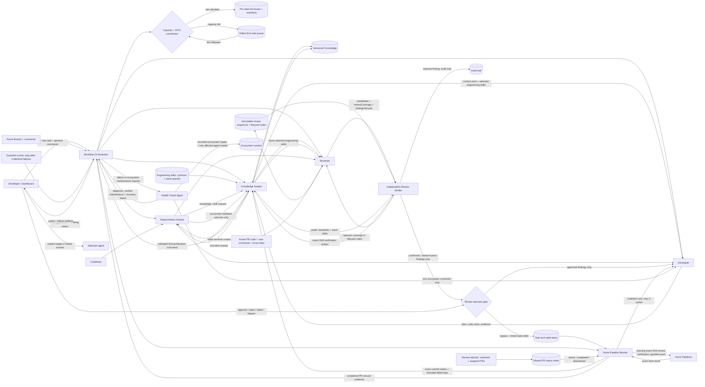
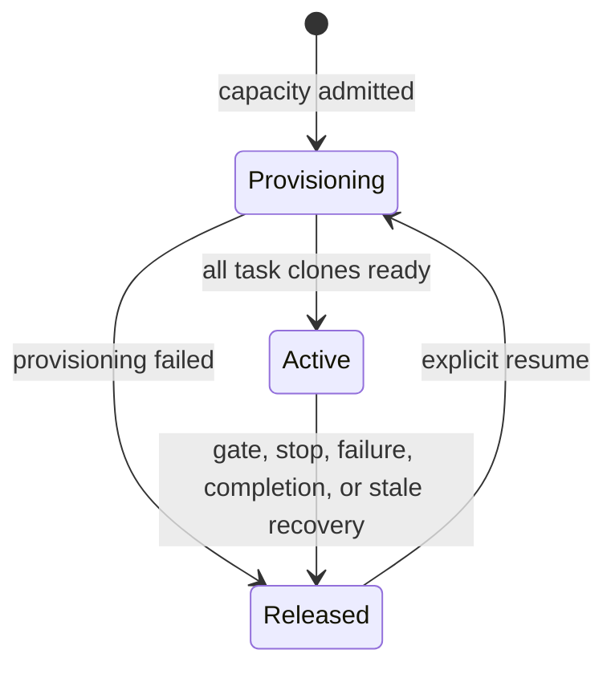

# Architecture and responsibilities

The editable vector overview is available below and as a standalone file: [ecosystem-architecture.svg](assets/ecosystem-architecture.svg).


## Repository composition

The repository-level diagram shows how source-controlled configuration, prompts, skills, scripts, generated agents, runtime state, and external services interact: [repository-architecture.svg](assets/repository-architecture.svg).


| Repository area | Role in the system |
|---|---|
| `config/agents.json` | Canonical agents, repositories, workspaces, credential strategy, modes, pipeline ownership/definition policy, health policy, knowledge paths, and approval gates |
| `prompts/common` | Evidence, task-protocol, and approval rules shared across roles |
| `prompts/roles` | Role-specific behavior for Orchestrator, Keeper, Analyst, Developer, Reviewer, independent Review Verifier, Pipeline Monitor, and Health Check Agent |
| `plugins/development-agent-ecosystem/skills` | Workflow and health-diagnostics skills plus vendored Azure PR and pipeline monitors |
| `scripts/AgentEcosystem.psm1` | JSON loading, semantic validation, path expansion, and TOML generation primitives |
| `scripts/Start-DevelopmentWorkflow.ps1` | Fresh-config startup, multi-repository workspace selection, task creation/resume, knowledge import, and Orchestrator launch |
| `scripts/Set-WorkflowInputRoute.ps1` | Idempotent task/comment routing plus a durable intent-scoped execution policy backed by `workflow-routing.jsonl` |
| `scripts/Request-OrchestratorCommentRouting.ps1` | Durable, idempotent return of out-of-scope targeted comments to Orchestrator with original-event traceability |
| `scripts/Switch-TaskWorkspace.ps1` | Capacity/FIFO admission, exact run/lease ownership, stale-lease reconciliation, and isolated full-clone provisioning for each task/repository pair |
| `scripts/Update-TaskWorkspaceLeaseHeartbeat.ps1` | Exact task/run/lease heartbeat renewal; lost ownership fails the active runner closed |
| `scripts/Repair-StaleTaskWorkspaceLeases.ps1` | Releases terminal or heartbeat-expired controller leases while preserving clones, manifests, and task-local evidence for resume |
| `scripts/Start-NextQueuedTask.ps1` | Oldest-first continuation whenever a capacity slot is released, without bypassing an older queued task |
| `scripts/Continue-AgentChain.ps1` | Event-driven next-link selection after successful targeted execution; uses a per-task exclusive lock, prioritizes authority handoffs to Orchestrator, normalizes repository scope, and preserves human, review, delivery, and failure gates |
| `scripts/Repair-AgentContinuations.ps1` | Deterministic reconciliation of durable successful outcomes whose trusted host exited before dispatch; never bypasses human gates and never duplicates a live continuation |
| `scripts/Invoke-ReviewedBranchDelivery.ps1` | Clean-review, clean-worktree, non-base, non-force branch push followed by exact-SHA monitoring |
| `scripts/Invoke-PostPushPipeline.ps1` | Exact pushed-ref verification, allowlisted build queueing, native run monitoring, result publication, and bounded Developer remediation routing |
| `scripts/Sync-TaskPullRequestStatus.ps1` | One-shot task-branch PR correlation; completed PR triggers final Keeper work, abandoned PR opens a question |
| `scripts/Sync-ActiveTaskPullRequests.ps1` | Shared model-free PR lifecycle index on a configurable schedule (120 minutes by default) |
| `scripts/Invoke-GuardedCodex.ps1` | Native Codex supervision, UTF-8 log normalization, three-identical-failure cutoff, and execution-guard artifacts |
| `scripts/Invoke-EcosystemHealthCheck.ps1` | Deterministic diagnostics, safe derived-state repairs, and OS-policy compatibility profile generation |
| `scripts/Start-AgentHealthRecovery.ps1` | One-attempt, ecosystem-only automatic source recovery using a bounded recent-log diagnostic bundle |
| `scripts/Save-AgentCheckpoint.ps1` | Private per-role context for running, waiting, or failed attempts; not shared with Knowledge Keeper |
| `scripts/Publish-AgentOutcome.ps1` | Validates configured artifacts, completes the role, and only then publishes its shared outcome |
| `scripts/Save-ReviewArtifactSnapshot.ps1` | Persists an immutable hash-addressed Reviewer snapshot and deterministic lifecycle index before Review Verifier starts |
| `scripts/New-DeveloperPublicationEvidence.ps1` | Runs final Pester and read-only Git checks and records machine-readable Developer publication evidence |
| `scripts/Test-AgentOutcomeArtifact.ps1` | Rejects incomplete coverage, invalid lifecycle transitions, stale verifier hashes, and contradictory outcome evidence before an agent result can be published |
| `scripts/Invoke-EnhancedReview.ps1` | Per-PR comment fingerprints, pending AI-processing state, and targeted Review Monitor invocation |
| `dashboard` | Full-width loopback UI with local diff review, coverage/verifier matrix, finding lifecycle, external PR reports, persisted statuses, live logs, interventions, manual closure, revision reopen, and tracked elevated runspaces |
| `knowledge/managed` | Versioned knowledge: global/technology engineering standards plus repository-scoped business, domain, API, integration, and product knowledge |
| `%LOCALAPPDATA%/Codex/development-agent-ecosystem` | Mutable task ledgers, review prompts, notes, reports, and scheduler backups |

### Extension points shown on the diagram

Dashed green `+` badges identify supported extension points:

| Badge | How to extend it |
|---|---|
| `+ REPOSITORIES` | Add an enabled object to `repositories[]`; the dashboard and Review Monitor pick it up on their next start |
| `+ PROMPT PATHS` | Add a Markdown file and reference it from the target agent's `promptPaths[]` |
| `+ SKILL.MD` | Add a plugin skill directory containing `SKILL.md` and `agents/openai.yaml`, then reference it from `skillPaths[]` |
| `+ KNOWLEDGE ROOT` | Add a seed source, managed component knowledge, or a verified decision root under `knowledge` |
| `+ UI / DOCS` | Add maintained operator guidance or dashboard assets without changing agent contracts |
| `+ VALIDATORS` | Extend semantic checks in `AgentEcosystem.psm1` and the corresponding JSON schema together |
| `+ COMPILE STEPS` | Extend agent TOML generation while keeping `config/agents.json` canonical |
| `+ WORKFLOWS` | Add a guarded runtime script and expose its responsibility through Orchestrator or the dashboard |
| `+ REVIEW INPUTS` | Add a trusted adapter that normalizes evidence before it enters the untrusted review context |
| `+ UI ROUTES` | Add a loopback API route with session-token validation and a matching dashboard control |
| `+ AGENT ROLE` | Add an agent object, role prompt, skills, handoffs, required artifacts, and schema coverage |
| `+ ARTIFACT SCHEMA` | Add a versioned JSON schema and include the artifact in the producer and consumer contracts |
| `+ AUTH` | Add a credential profile that references a CLI or environment-variable name, never a plaintext secret |

## Component interaction

Agent progression is host-driven and event-based: Orchestrator classifies task intake and general comments from the current JSON responsibility directory, then every successful initial, resume, or targeted run returns to the trusted host, which starts the next eligible role directly. Successful publication first appends a durable `continuation-requested` event. If the host exits before the next dispatch, a local non-AI reconciler resumes only the missing transition after the configured grace period; a global recovery lock and per-task chain lock make this idempotent. Roles never poll one another or remain alive to wait for the next role. Developer completion may cross `review_pending` only to start Reviewer; Reviewer completion may cross it only to start the separate Review Verifier. Coverage/lifecycle rejection returns only Reviewer and Review Verifier to pending; confirmed or escalated findings reach the human gate, while verifier-rejected findings remain audit-only. A machine-readable Pipeline remediation may cross its waiting gate only to start Developer. All other human-input and approval gates stop the chain. A per-run bound allows at most sixteen handoffs and at most three repetitions of one role-to-role transition; exceeding either bound persists a failure and hands it to Health Check. A global workspace coordinator admits up to the configured task capacity and grants exactly one controller lease per task. Every selected repository is a separate full clone scoped to that task; overflow work is a durable FIFO queue. Per-task state locks, exact run/lease identifiers, and immutable execution snapshots prevent status, context, and stop/resume actions from crossing task boundaries. Failed execution and explicit source-controlled ecosystem maintenance are handed to Health Check; its bounded `ecosystem_recovery` coordinator may change only the ecosystem repository, validates the result, and gets one affected-agent-only retry. Product code remains Developer-owned. Review Monitor owns authored/assigned PR discovery and the shared status index, while Pipeline Monitor owns exact task-branch correlation, build/remediation, and the completion gate.

Routing and knowledge are separate. Orchestrator owns task/comment classification and dispatch but performs no delivery work. Persisting a route appends an addressable input and never rewrites the selected agent's existing status. When new input changes work owned by a completed, waiting, interrupted, or failed role, Orchestrator may request its targeted restart; only trusted host continuation starts it after Orchestrator succeeds. `pipeline.ownership` makes the pipeline chain explicit: monitoring belongs to Pipeline Monitor, supported product remediation to Developer, candidate remediation review to Reviewer, exact-artifact verification to Review Verifier, exceptions to Orchestrator, ecosystem recovery to Health Check, and final publication to Knowledge Keeper. Reviewer and Review Verifier are separate invocations with separate prompts, activity, checkpoints, and outcomes; the verifier receives the persisted review, requirements, source/tests, accepted knowledge, and immutable prior review snapshots, but never Reviewer private checkpoints or hidden reasoning. A completed-PR signal follows `Pipeline Monitor -> Orchestrator -> Knowledge Keeper`: Orchestrator verifies the persisted terminal gate and routes one final-publication command. Knowledge Keeper issues a minimal context on request and answers explicit knowledge or skill requests throughout delivery; it never loops over `wait` or polls role logs. Each role autonomously sizes coherent work blocks and reads only direct or Orchestrator-routed comments once per checkpoint. Working details remain private until the role succeeds. Only a validated terminal outcome enters shared context, where Knowledge Keeper decides whether it changes task decisions, coding rules, or managed knowledge. After all applicable roles complete, it writes `task-summary.json`. The repository/definition policy is summarized in [pipeline monitoring and ownership](pipeline-monitoring.md).

The latest persisted routing record is also the task's active execution policy. It contains the requested mode, permitted agent sequence, code-change permission, and automatic-continuation flag. The trusted host defaults legacy records to `full-delivery`, but a new `research-only` or other narrow decision stops after its configured roles and leaves excluded pending roles skipped.

Before dispatch, the trusted host rebuilds `context-pack.json` for the exact recipient from the resume plan. Every referenced stable artifact receives a concise summary and SHA-256 fingerprint, and the host validates those fingerprints before the model starts. If a scheduled agent has already failed, the continuation reconciler will not restart it merely because its previous host disappeared: an exact-signature `health-recovery-result.json` with status `repaired` is required first.



## Task lifecycle

```mermaid
sequenceDiagram
    participant U as Developer
    participant O as Workflow Orchestrator
    participant W as Workspace Coordinator
    participant K as Knowledge Keeper
    participant A as Requirements Analyst
    participant D as Developer Agent
    participant R as Reviewer Agent
    participant V as Review Verifier
    participant P as Pipeline Monitor
    participant H as Health Check Agent
    participant G as Execution Guard

    U->>O: task ID / URL / selected repositories / instruction
    O->>W: request capacity lease for exact task/run
    alt capacity full or an older task is queued
        W-->>O: queued with FIFO position; do not start agents
    else slot is admitted
        W->>W: provision or reuse one full clone per repository
        W-->>O: exact run/lease plus clone manifests
    end
    O->>O: classify task against current responsibilities
    O->>A: routed task intake
    A->>K: bounded knowledge / skill request
    K-->>A: verified context pack
    A-->>O: ready scope, held scope, questions, sources
    alt independent ready scope exists
        O->>D: approved implementation context
        D-->>K: successful implementation outcome
        D-->>O: completed status and artifact references
        O->>R: requirements + held scope + implementation
        R-->>K: candidates, complete coverage matrix, lifecycle
        R-->>O: exact review artifact reference
        O->>V: persisted review + public evidence + prior snapshots
        V-->>K: successful exact-SHA verification outcome
        alt coverage or lifecycle claim rejected
            V-->>O: review-rework-required
            O->>R: correct rejected review claims
        else confirmed / needs-human finding exists
            V-->>O: verified human-decision gate
            U->>O: approve / reject / defer / bypass finding
            O->>D: approved confirmed findings only
        else clean or verifier-rejected findings only
            V-->>P: verified clean delivery gate
        end
        P->>P: guarded branch push bound to review SHA
        P-->>K: successful exact-SHA outcome for shared knowledge
        P-->>O: delivery status
        alt code or test failure and cycle remains
            P-->>O: pipeline-remediation-request
            O->>D: only the failed code/test scope
            D->>R: locally verified remediation
            R-->>O: remediation review
            U->>D: approve remediation finding when required
            D->>P: new pushed SHA + remediation cycle
        else infrastructure / unknown / no run / limit reached
            P-->>O: terminal evidence for Health or operator gate
        end
        P-->>O: completed PR closure evidence
        O->>K: validated final-publication command
        K->>K: publish verified knowledge and task history
    else an agent or workflow fails
        G->>G: count normalized identical failures
        G-->>O: third failure + persisted guard artifact
        O->>H: failure signature + bounded recent tails
        H-->>O: diagnosis and deterministic repair result
        O->>H: one bounded ecosystem-only recovery attempt
        H-->>O: repaired / waiting / failed + validation
        O-->>U: live recovery status and Resume action
    else all scope is blocked by unanswered questions
        A-->>U: question-opened + waiting status + explicit hold
        U->>A: linked answer
        U->>O: general corrective command
        O->>A: routed correction
    end
```

### Workspace lease lifecycle

Task status, controller lease lifecycle, and clone lifecycle are separate. A task can wait, fail, or be interrupted without lending its context or clone to another task.



`queued` tasks have no controller lease. The coordinator admits the oldest eligible queued task only after capacity is available. `Released` is a workspace-manifest lifecycle value, not deletion: the full clone, task branch, uncommitted changes, artifacts, and task history stay bound to the same task for explicit resume. A failed first-time provision removes only its own incomplete clone and lease.

| Isolation boundary | Durable owner | Cross-task protection |
|---|---|---|
| Capacity lease | Global coordinator record keyed by exact task/run/lease | One controller per task; stale release targets only the matching lease. |
| Task status and timeline | `tasks/<task-id>/task.json` and `task-ledger.jsonl` | Status, comments, failures, and revisions are read and written under one task lock. |
| Repository workspace | Task-local manifest plus one full clone per `(taskId, repositoryId)` | A task never uses another task's clone or the operator/reference checkout. |
| Model context | Immutable execution configuration/context plus per-agent checkpoints | A run consumes its own snapshots and task artifacts; unfinished role context is not published across tasks. |
| Dashboard action | Task revision plus exact run/lease ownership | A stale tab cannot stop, resume, or mutate a newer or different run. |

## Per-task artifacts

Runtime task history is stored outside the repository under `%LOCALAPPDATA%/Codex/development-agent-ecosystem/tasks/<task-id>`:

- `task.json`: task identity, ordered `repositoryIds[]`, backward-compatible primary `repositoryId`, and current state;
- `task-ledger.jsonl`: append-only communication, workflow and agent status, `question-opened` / `question-resolved`, and user intervention comments;
- `workflow-routing.jsonl`: idempotent Orchestrator decisions linking each task/comment input to one or more agent owners;
- `workspaces/<repository-id>.json`: clone manifest with task/repository identity, absolute path, canonical origin, base SHA, unique branch, lifecycle, run ID, and lease ID;
- `execution-config-<run-id>.json` and `execution-context-<run-id>.json`: immutable configuration and context snapshots used by that run;
- `agent-activity.jsonl`: append-only factual per-agent progress used by the configurable live dashboard view;
- `resume-plan.json`: the checkpoint snapshot listing only agents permitted to run and completed agents that must be preserved;
- `resume-artifact-index.json`: per-agent SHA-256 fingerprint baselines used to identify changed artifacts without model rereads or cross-role consumption;
- `agent-checkpoints/<agent-id>.json`: private unfinished-role context, never consumed by Knowledge Keeper or the dashboard outcome viewer;
- `context-pack.json`: context selected by Knowledge Keeper;
- `requirements-analysis.json`: ready scope, held scope, gaps, and questions;
- `implementation-plan.json` and `implementation-result.json`;
- `review-result.json`: candidate findings, exact requirement traceability, complete ten-dimension `reviewCoverage`, and stable `findingLifecycle` records;
- `review-history/review-<sha256>.json` plus `review-history-index.json`: immutable prior review artifacts used to validate `new`, `unchanged`, `resolved`, and `regressed` transitions;
- `review-verification.json`: separate verifier verdicts for every coverage dimension, active finding, and lifecycle record, bound to the exact review SHA and revision;
- `review-decisions.json` and `tech-debt-items.json`: human decisions and bypass debt bound to that same exact review; a `bypassed` decision is non-resolution and is deliverable only while its linked `TD-REV-NNN` item is open;
- `delivery-result.json`, `pipeline-result.json`, `pull-request-status.json`, optional `pipeline-remediation-<signature>.json`, `knowledge-update.json`, and final `task-summary.json`;
- `task-closure.json` plus `revisions/revision-<n>/` snapshots for manual closure and bug/rework reopen.
- `agent-failure-*.json`, `health-check-result.json`, `health-recovery-result.json`, and health recovery logs.
- `health-repair-routing.json` records a bounded, single-owner correction handoff when Health Check cannot perform the repair inside the ecosystem recovery workspace.

The global `%LOCALAPPDATA%/Codex/development-agent-ecosystem/workspace-coordinator.json` records active task leases up to `maxActiveTasks`; its lock file serializes admission, heartbeat, recovery, and release. Each lease records the controller PID and process-start identity. Before admission, terminal leases and leases whose exact heartbeat is older than `staleLeaseGraceSeconds` are released without deleting their clone; PID/start identity distinguishes an exited host from an expired in-process runspace while active runners refresh exact task/run/lease ownership every `leaseHeartbeatSeconds`. Full clones live below `workflow.workspaceScheduling.workspaceRoot/task-<task-key>/repo-<repository-key>`, while manifests live in the task directory. A released clone is retained for explicit resume and is never reused by another task. No scheduler path executes in `repositories[].localWorkspace` or uses worktrees, reset, clean, or Git stash for task switching.

`task.json` is a current-state projection used for fast dashboard rendering. `task-ledger.jsonl` remains the durable public history. Open questions are reconstructed by subtracting every `question-resolved` evidence reference from `question-opened` events; a targeted dashboard answer closes only its selected question. Applicable comments are coalesced at end-of-block checkpoints, so saving comments does not restart a running role. Agents do not poll while a block is running and perform a final comment check before outcome publication. General resume computes a checkpoint and dispatches only unfinished roles; explicit targeted restart dispatches exactly one stopped or completed role. Per-agent baselines in `resume-artifact-index.json` let each role reuse summaries for artifacts it previously consumed without allowing another role to advance its baseline. Only the resume plan supplied to an agent advances that agent's baseline; post-outcome bookkeeping preserves every baseline so the next chained role receives every hash-divergent artifact as changed. The dashboard polling itself is deterministic and does not invoke a model. Health recovery receives configured tails rather than complete historical logs. PR comment fingerprints are stored per PR; only that PR is forced, while `pending-review-changes.json` records `pending-ai-review` or `requires-human-intervention` until AI processing succeeds. Pipeline Monitor uses low reasoning effort and lets its native monitor perform repeated status polling without repeated model turns. Post-push classification is also deterministic: only code/test failures create a deduplicated Developer request, while infrastructure/no-run/unknown states remain at their proper gate and the cycle stops after three attempts.

Every context pack has an `engineeringGuidance` section. Knowledge Keeper derives the stack from repository evidence, always selects pragmatic DRY, KISS, SOLID, YAGNI, separation-of-concerns, testability, and maintainability guidance, and adds only the applicable .NET, JavaScript/TypeScript, and React skills. Developer implements against that selection; Reviewer uses it to produce evidence-backed candidates and coverage; Review Verifier uses the same public guidance independently to try to falsify those claims.

Schemas are stored under `config/schemas`. Knowledge Keeper may publish only evidence-backed claims with all required evidence fields.
